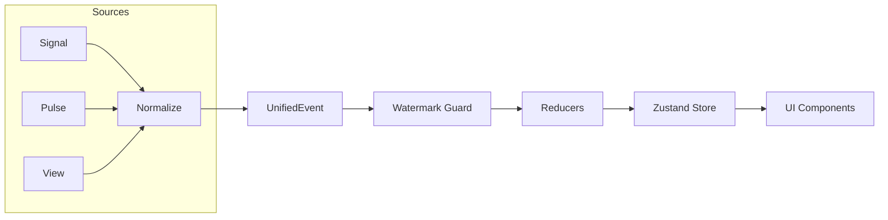

# API & State Sync Design Architecture (V2)

This document codifies the "Three-Layer + Bus" model for real-time data synchronization between Supabase and the V2 frontend.

## 0. The Four Namespaces

To ensure system-wide consistency and prevent "deadlock" or "mis-merge" scenarios, we define four distinct namespaces:

| Namespace | Format | Description |
| :--- | :--- | :--- |
| **EntityKey** | `e:<topic>:<id>` | Canonical identity (e.g., `e:card:uuid`, `e:dashboard:me`). |
| **ViewKey** | `v:<name>` | Visual collection identity (e.g., `v:due_list`, `v:question_list`). |
| **PulseKey** | `p:<table>:<id>` | Transient state update target. |
| **WatermarkKey** | `wm:<source>:<target>` | Track point-in-time progress per source (Signal/Pulse/View). |

> [!IMPORTANT]
> **Sequence Source**: `seq` MUST be generated by the Database using a global sequence (e.g., `nextval('public.realtime_seq')`) to ensure cross-device monotonicity.

---

## 1. Unified Event Model

All incoming data (Postgres Changes, View Fetches) is normalized into a `UnifiedEvent`:



### Event Structure
```ts
export type SourceKind = 'signal' | 'pulse' | 'view';

export interface UnifiedEvent {
    source: SourceKind;
    topic: string;           // e.g. "card", "due_list"
    entityKey: string;       // e.g. "uuid", "global"
    op: 'UPSERT' | 'UPDATE' | 'REMOVE' | 'REFRESH';
    updatedAt: string;       // ISO string
    seq: number;             // Tie-breaker
    payload: any;            // Data delta or snapshot
}
```

---

## 2. Backend Design (ElysiaJS)

The backend provides "View-level" endpoints optimized for diff-merging.

### Standard Response Protocol (camelCase)
```ts
export type ViewResponse<T> = {
    items: T[];              // Each item MUST carry 'updatedAt' and 'seq'
    deletedIds?: string[];   // Tombstones for client-side removal
    serverTime: string;      // Current DB time for watermark alignment
    etag?: string;           // For 304 Not Modified support
};
```

### Core Endpoints & Topics
- **Dashboard**: Standardized as an **Entity** (`e:dashboard:me`). Updated via `user_dashboard_pulse`. No separate view revalidation required for basic stats.
- **View APIs**: `GET /v/due-list`, `GET /v/question-list`, `GET /v/assets`.

---

## 3. Frontend Architecture

The frontend follows a "Scheduler-driven" revalidation pattern:

### Pipeline Responsibility
The pipeline is a pure "Router & Guard":
1. **Normalize**: Map raw DB rows to `UnifiedEvent`.
2. **Watermark Guard**: Compare `(at, seq)` tuple. Drop old events.
3. **Dispatch**: Send `entity_patch` to Store OR `markStale` to Scheduler.
*Crucial: Pipeline never fetches data.*

### Optimization Principles
1. **Explainable UX**: Every background sync should have a corresponding UI state (badge or tiny dot).
2. **Low-Jitter**: Prefer patching individual entity fields in the store over re-rendering the whole page.
3. **Visibility Gating**: Do not revalidate "Due List" if the user is currently on the "Settings" page.

---

## 4. Database Optimizations

- **Signal Purging**: Automated background worker to delete `realtime_signals` older than 1 hour.
- **Topic Scaling**: Topics mapped to Postgres Partition keys for high-volume deployments.
