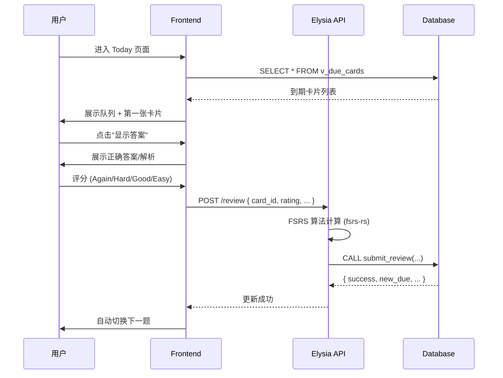

# Smart Error Archiver V2 设计理念与架构文档

> **Version**: V5.9 (Production Hardened & Audit Ready)
> **架构定位**: 错题内容库 + FSRS 记忆卡片系统 + 考试与导入 + 可审计管理

---

## 产品核心定位

V2 不是一个简单的"题库列表"应用，而是构建在 **B.E.R.R.S. Stack** 上的生产级学习系统：

```
Today(到期卡片队列) → 题目呈现 → 用户作答 → 评分(1-4) → 写日志 + 更新卡片
```

其它功能（题库管理/标签学科/导入/考试）都围绕这个核心复习闭环服务。

---

## 核心功能目标 (Functional Targets)

### 智能复习与调度 (FSRS v5 Engine)
- **毫秒级调度**: Rust 编写的 FSRS v5 算法，计算延迟 < 1ms
- **状态全固化**: 记录每次复习的算法版本、权重配置哈希，支持记忆曲线完美回溯
- **多端同步脉冲**: `cards_sync_pulse` 确保多设备进度毫秒级同步

### 极致题目管理与版本控制 (Asset Management)
- **内容指纹**: 任何细微修改触发 SHA256 指纹更新
- **原子级 Fork Sync**: 用户 Fork 公共题目，源题更新时自动标记"检测到变更"
- **资源冷热分离**: 题目内容（冷数据）走 RLS 缓存，复习状态（热数据）走 Realtime Pulse

### 生产级管理流水线 (Management Pipeline)
- **后悔药机制**: 所有学科/标签操作记录流水，支持一键撤销
- **软删除架构**: `deleted_at` 标记 + 条件唯一索引，保证可恢复性

### AI 赋能 (Data Intelligence) [规划中]
- **零成本录入**: 多模态 AI 解析图片/PDF/手写稿
- **语义检索**: pgvector Embedding 实现超越关键词的搜索
- **智能标签建议**: 向量相似度计算自动推荐分类

---

## 信任边界架构 (Trust Boundary Model)

系统通过 **"Trust-Boundary"** 模式重构，将安全敏感的计算逻辑从中性读取中分离。

### 架构分层

```
[前端 React] → [Elysia API] → [Rust fsrs-rs] → [DB RPC]
      ↓             ↓              ↓             ↓
  UI/交互      编排/校验      算法计算       锁+存储
```

### 三层分工法则

| 层级 | 定位 | 权限 | 职责 |
|:---|:---|:---|:---|
| **浏览器前端** | 交互中心 | `anon`/`authenticated` | UI/UX、简单 CRUD、收集用户输入 |
| **后端编排层** | 编排与算力中心 | `service_role` | 调用 Rust 计算、跨表编排、安全校验 |
| **数据库存储层** | 一致性中心 | `SECURITY DEFINER` | 原子写入、幂等屏障、硬规则校验 |

### 数据流路径

1. **快速读取**: 前端 → Supabase (User JWT + RLS)
2. **特权操作**: 前端 → Elysia (Eden Call) → DB RPC (Service Role)
3. **实时同步**: DB Triggers → Pulse Tables → Websockets → 前端

---

## 1. 数据模型：双层架构设计

### 1.1 资产层 (Asset Layer) — 题目即资产

**`error_questions` 表核心设计理念：**

| 特性 | 实现方式 | 价值 |
|:---|:---|:---|
| **Public/Private 双轨** | `user_id IS NULL` = 共享题库 | 支持公共题库 + 私有定制 |
| **Fork/Sync 版本控制** | `forked_from`, `content_hash`, `last_synced_hash` | 题目可分叉、可追溯、可同步 |
| **结构化答案** | `correct_answer` JSONB + 触发器校验 | 支持选择/填空/简答三种题型的严格验证 |
| **内容哈希** | SHA256 自动计算 | 变更检测 & Fork Drift 提醒 |

**题目资产的生命周期：**
```
公共题库 → Fork(保存到我的) → 私有题(forked_from 指向源) → 同步更新(sync_fork)
```

### 1.2 学习层 (Overlay Layer) — 卡片即状态

**`cards` 表核心设计理念：**

题目是"资产"（可共享、可 fork），学习状态纯私有于用户。

| 字段 | 用途 |
|:---|:---|
| `state/stability/difficulty` | FSRS 核心算法状态 |
| `due/reps/lapses` | 复习调度参数 |
| `notes` | 用户个人笔记 |
| `personal_tags` | 学习层快捷标记（想复习/易错/本周冲刺） |
| `last_user_answer/last_wrong_answer` | 行为追踪 |

**关键设计决策：标签双轨制**
- **知识点标签** (`error_question_tags`): 资产层，用于组卷/筛题
- **个人标签** (`cards.personal_tags`): 学习层，用于快速标记

### 1.3 审计层 (Audit Layer) — 日志即证据

**`review_logs` 表设计理念：**

| 字段 | 价值 |
|:---|:---|
| `rating (1-4)` | 学习效果锚点 |
| `review_duration_ms` | 时间投入追踪 |
| `algo_version` | 算法版本化 (A/B 测试/回滚定位) |
| `config_id` → `fsrs_configs` | 权重快照引用 (100% 参数还原) |
| `client_request_id` | 幂等性防护 (防网络重试) |

---

## 2. 关键实体与责任边界

### 2.1 六大一级入口

| 入口 | 数据源 | 核心功能 |
|:---|:---|:---|
| **Today (复习)** | `v_due_cards` + `cards` | 到期卡片队列 → 复习闭环 |
| **Library (题库)** | `error_questions` + 标签 | 题目资产管理 |
| **Card (学习记录)** | `cards` + `review_logs` | 单卡学习状态详情 |
| **Exam (练习/考试)** | `exam_records` | 成套训练与回溯 |
| **Import (导入中心)** | `import_jobs` | 生产级导入队列 |
| **Manage (管理)** | `subjects/tags` + logs | 合并撤销 & 软删除 |

### 2.2 核心视图：`v_due_cards`

专为复习场景优化的物化查询：

```sql
SELECT 
  c.id AS card_id,
  c.due, c.state, c.stability, c.difficulty AS card_difficulty,
  c.reps, c.lapses,
  q.title, q.question_type, q.difficulty AS question_difficulty,
  s.name AS subject_name, s.color AS subject_color
FROM cards c
JOIN error_questions q ON c.question_id = q.id
LEFT JOIN subjects s ON q.subject_id = s.id
WHERE c.user_id = auth.uid()
  AND c.due <= now()
  AND q.is_archived = false
  AND (s.id IS NULL OR s.deleted_at IS NULL);
```

---

## 3. 核心流程设计

### 3.1 复习闭环 (Review Loop)



**`submit_review` RPC 原子保证：**
1. FOR UPDATE 锁防止并发更新
2. 事务原子性：log + card 同时成功/失败
3. 幂等性：相同 `client_request_id` 返回缓存结果

### 3.2 Fork & Sync 流程

**Fork 流程 (`fork_question_to_private`)：**
```
检查可见性 → 创建私有副本 → 克隆标签 → 迁移/创建卡片 → 返回新题 ID
```

**Sync 检测流程 (`check_fork_status`)：**
```json
{
  "is_fork": true,
  "has_update": true,
  "diff_summary": {
    "title_changed": false,
    "content_changed": true,
    "answer_changed": false
  }
}
```

**Sync 执行流程 (`sync_fork`)：**
```
锁定题目 → 拉取父题内容 → 覆盖更新 → 更新 last_synced_hash
```

### 3.3 导入任务队列 (Import Jobs)

**状态机：**
```
queued → running → partial/done/failed
           ↑          ↓
           └──────────┘ (retry)
```

**Worker 抢占模式 (`claim_import_job`)：**
```sql
SELECT * FROM import_jobs
WHERE status IN ('queued', 'partial', 'failed')
  AND (next_retry_at IS NULL OR next_retry_at <= now())
ORDER BY created_at
LIMIT 1 FOR UPDATE SKIP LOCKED;
```

### 3.4 实体合并与撤销

**合并流程 (`merge_subjects/merge_tags`)：**
1. 事务级咨询锁 (防并发)
2. 收集受影响 IDs
3. 执行迁移
4. 软删除源实体
5. 记录日志 (含完整快照)

**撤销流程 (`undo_management_op`)：**
1. 恢复实体 (`deleted_at = NULL`)
2. 还原关联关系
3. 标记日志已撤销

---

## 4. 实时同步架构：三层信号模型

### 4.1 架构概览

```
┌─────────────────────────────────────────────────────────────┐
│                    Supabase Realtime                         │
├─────────────────┬─────────────────┬─────────────────────────┤
│  Signal Hub     │  Pulse Tables   │  Dashboard Snapshot     │
│  (Invalidation) │  (Lite Sync)    │  (Aggregated)           │
├─────────────────┼─────────────────┼─────────────────────────┤
│ realtime_signals│ cards_sync_pulse│ user_dashboard_pulse    │
│                 │ import_jobs_pulse│                        │
└────────┬────────┴────────┬────────┴────────────┬────────────┘
         │                 │                     │
         ▼                 ▼                     ▼
   Notify: "刷新列表"   Sync: due/state/lapses  Banner: due_count/streak
```

### 4.2 信号类型 (`realtime_topic_enum`)

| Topic | 用途 |
|:---|:---|
| `question` | 单题更新/删除 |
| `question_list` | 题库列表刷新 |
| `exam` | 考试状态变更 |
| `due_list` | 复习队列刷新 |
| `asset` | 学科/标签变更 |
| `job` | 导入任务状态 |
| `card` | 单卡更新/删除 |
| `card_overlay` | 个人标签变更 |

### 4.3 Pulse 表设计

**`cards_sync_pulse`** — Today 列表专用：
```sql
card_id, user_id, due, state, lapses, updated_at, seq
```

**`import_jobs_pulse`** — 轻量任务状态：
```sql
job_id, user_id, status, total_rows, processed_rows, 
success_count, error_count, last_error, ...
```

**`user_dashboard_pulse`** — 仪表盘聚合：
```sql
user_id, due_count, next_due_at, streak_days, last_study_day
```

### 4.4 触发器链路

| 源表变更 | 触发信号 |
|:---|:---|
| `cards` INSERT/UPDATE | → `cards_sync_pulse` + `dashboard_pulse` |
| `cards` DELETE | → `card:REMOVE` + `due_list:REFRESH` |
| `error_questions` UPDATE | → `question:UPDATE` + (fork drift 通知) |
| `import_jobs` UPDATE | → `import_jobs_pulse` + `job:UPDATE` |

---

## 5. 安全模型

### 5.1 RLS 策略矩阵

| 表 | SELECT | INSERT | UPDATE | DELETE |
|:---|:---|:---|:---|:---|
| `subjects/tags` | 公共+私有 | 仅私有 | 仅私有 | 软删除 |
| `error_questions` | 公共+私有 | 仅私有 | 仅私有 | 仅私有 |
| `cards` | 仅私有 | 校验可见题 | 校验可见题 | 仅私有 |
| `review_logs` | 仅私有 | 校验卡片归属 | — | 仅私有 |

### 5.2 SECURITY DEFINER 函数规范

所有敏感 RPC 必须：
1. `SET search_path = pg_catalog, public` (防搜索路径劫持)
2. 内部执行 `auth.uid()` 鉴权
3. 仅授权给 `authenticated` 或 `service_role`

**关键函数权限：**
- `submit_review`: → `service_role` only (算法来自 Elysia)
- `fork_question_to_private`: → `authenticated`
- `claim_import_job`: → `service_role` only
- `merge_*`, `undo_*`: → `authenticated`

### 5.3 数据完整性触发器

| 触发器 | 保护 |
|:---|:---|
| `validate_correct_answer` | 答案结构严格校验 |
| `check_card_question_active` | 禁止关联已归档题目 |
| `check_asset_soft_deleted` | 禁止关联已软删除资产 |
| `check_public_asset_integrity` | 公共题不引用私有资产 |
| `validate_exam_question_security` | 考试题目可见性校验 |

---

## 6. 前端架构：三层 + 总线模型

### 6.1 数据流架构

```
┌──────────────────────────────────────────────────────────┐
│                    Data Sources                           │
├────────────┬────────────┬────────────────────────────────┤
│  Signal    │   Pulse    │      View API                  │
│  (ws)      │   (ws)     │      (fetch)                   │
└─────┬──────┴─────┬──────┴────────────┬───────────────────┘
      │            │                   │
      ▼            ▼                   ▼
┌──────────────────────────────────────────────────────────┐
│                   Normalize → UnifiedEvent               │
└──────────────────────────────────────────────────────────┘
                          │
                          ▼
┌──────────────────────────────────────────────────────────┐
│                   Watermark Guard                         │
│         Compare (updatedAt, seq) → Drop old              │
└──────────────────────────────────────────────────────────┘
                          │
                          ▼
┌──────────────────────────────────────────────────────────┐
│                   Zustand Store                           │
│    entities: { cards, questions, dashboard }             │
│    watermarks: Record<WatermarkKey, string>              │
│    staleViews: Set<ViewKey>                              │
└──────────────────────────────────────────────────────────┘
                          │
                          ▼
┌──────────────────────────────────────────────────────────┐
│               TanStack Query (View Cache)                │
│    /v/due-list, /v/question-list, /v/assets              │
└──────────────────────────────────────────────────────────┘
```

### 6.2 命名空间约定

| Namespace | 格式 | 示例 |
|:---|:---|:---|
| EntityKey | `e:<topic>:<id>` | `e:card:uuid` |
| ViewKey | `v:<name>` | `v:due_list` |
| PulseKey | `p:<table>:<id>` | `p:cards_sync:uuid` |
| WatermarkKey | `wm:<source>:<target>` | `wm:pulse:card:uuid` |

### 6.3 UX 原则

1. **低摩擦复习**：评分按钮固定底部，键盘快捷键 1/2/3/4
2. **可解释同步**：信号携带 `reason` 字段，UI 可展示变更原因
3. **渐进刷新**：优先 patch 单实体，而非重渲染整个列表
4. **可见性门控**：仅对当前可见视图执行 revalidation

---

## 7. 题型系统

### 7.1 题型定义 (`question_type_enum`)

| 类型 | 标识 | 答案结构 |
|:---|:---|:---|
| 选择题 | `choice` | `{ type: "choice", choice_ids: [...] }` |
| 填空题 | `fill_blank` | `{ type: "fill_blank", blanks: [...] }` |
| 简答题 | `short_answer` | `{ type: "short_answer", answers: [...] }` |

### 7.2 hints 结构约定

```json
{
  "choices": [
    { "id": "uuid-a", "text": "选项A" },
    { "id": "uuid-b", "text": "选项B" }
  ],
  "optionAnalysis": {
    "uuid-a": { "why": "正确，因为..." },
    "uuid-b": { "why": "错误，因为..." }
  },
  "hints": ["提示1", "提示2"]
}
```

### 7.3 正确答案校验触发器

`validate_correct_answer()` 执行：
- `type` 字段必须存在且与 `question_type` 一致
- `choice`: 必须有非空 `choice_ids` 数组或 `choice_id`
- `fill_blank`: 必须有非空 `blanks` 数组
- `short_answer`: 必须有非空且去重的 `answers` 数组

---

## 8. FSRS 算法集成

### 8.1 参数归档 (`fsrs_configs`)

**内容寻址存储 (Content-Addressable)：**
```sql
hash = sha256(weights::text)  -- 64 字符 hex
weights = [0.212, 1.2931, ...]  -- 21 个参数
```

**目的：**
1. 100% 还原历史复习时的算法参数
2. 全局去重 (不同用户使用相同权重只存一份)
3. 不可变保证 (禁止 UPDATE/DELETE)

### 8.2 复习日志关联

```sql
review_logs.config_id → fsrs_configs.id  -- 仅 4 bytes
```

可精确追溯：
- 该次复习使用了哪个版本的权重
- 该权重配置在多少次复习中被使用

### 8.3 算法版本跟踪

```sql
review_logs.algo_version TEXT DEFAULT 'fsrs_v5'
```

支持：A/B 测试、版本回滚定位、长期数据分析。

---

## 9. 优先级路线图

### Phase 1: 核心复习闭环
- [x] `v_due_cards` 视图
- [x] `submit_review` RPC
- [ ] Today 页面 UI
- [ ] 评分组件 (1-4 映射 Again/Hard/Good/Easy)

### Phase 2: 题目资产管理
- [x] Fork/Sync RPC
- [ ] 题目详情双层视图 (Asset vs Overlay)
- [ ] Fork Drift UI 提示条

### Phase 3: 训练与考试
- [x] `exam_records` 表
- [x] `get_exam_questions` RPC
- [ ] Exam 模式 UI
- [ ] 错题一键入复习

### Phase 4: 导入中心
- [x] `import_jobs` 队列表
- [x] `claim_import_job` Worker RPC
- [ ] Import Center UI
- [ ] 错误详情 + 重试

### Phase 5: 管理与撤销
- [x] `merge_*` + `undo_*` RPC
- [x] `management_logs` 审计表
- [ ] Manage UI (操作记录 + 撤销)

---

## 10. 技术栈总结

| 层 | 技术 |
|:---|:---|
| **Database** | PostgreSQL 15 + Supabase |
| **Realtime** | Supabase Realtime (Postgres Changes) |
| **Backend** | Elysia.js + Bun + fsrs-rs (Rust WASM) |
| **Frontend** | React + Zustand + TanStack Query + Vite |
| **Styling** | Liquid Glass Design System (Custom CSS) |

---

## 附录 A: 核心 RPC 清单

| 函数 | 权限 | 用途 |
|:---|:---|:---|
| `submit_review` | service_role | 原子写入复习记录 |
| `fork_question_to_private` | authenticated | Fork 公共题到私有 |
| `check_fork_status` | authenticated | 检测 Fork 更新状态 |
| `sync_fork` | authenticated | 同步父题更新 |
| `get_exam_questions` | authenticated | 随机抽取考试题目 |
| `claim_import_job` | service_role | Worker 抢占导入任务 |
| `merge_subjects` | authenticated | 合并学科 |
| `merge_tags` | authenticated | 合并标签 |
| `undo_management_op` | authenticated | 撤销管理操作 |
| `purge_soft_deleted_data` | service_role | 清理软删除数据 |
| `purge_realtime_signals` | service_role | 清理过期信号 |

---

## 附录 B: 预置数据

**全局学科：**
- 数学 `#4caf50`
- 英语 `#3f51b5`
- 语文 `#f44336`

**全局标签：**
- 重要 `#ff9800`
- 易错 `#e91e63`
- 基础 `#2196f3`
- 高频考点 `#f44336`

**全局复习设置：**
- 保留率: 90%
- 最大间隔: 365 天
- 日切换时间: 凌晨 4:00
- 默认时区: UTC
